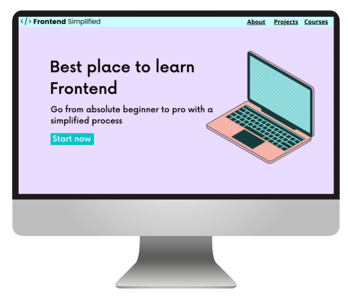

# Build-Your-Website
DOCTYPE html>
<html lang="en">
<head>
    <meta charset="UTF-8">
    <meta name="viewport" content="width=device-width, initial-scale=1.0">
    <title>Document</title>
</head>
<body>
  <section>
    <nav>
      
        <ul>
            <li><a href="#about">About</a></li>
            <li><a href="#discord">Discord</a></li>
            <li><a href="#contact">Contact</a></li>
        </ul>
    </nav>
    <header>
        

            <h1>Best place to learn Frontend</h1
            
Go from absolute beginner to pro with a simplified process

            <button>Start Now</button>
        

        <figure>
            
        </figure>
    </header>
  </section>
  <main>
    <section id="about"> 
        <h2>About</h2>
        

        
Lorem ipsum dolor sit amet consectetur adipisicing elit. Ad facilis, cumque temporibus at sequi fuga ab iure provident aut nobis blanditiis quo alias a beatae in, assumenda, vero neque explicabo.

        
Lorem ipsum dolor sit amet consectetur adipisicing elit. Ad quisquam perspiciatis, possimus voluptates corporis a quibusdam, sint quam eos numquam, optio officia consequuntur sed culpa fugit quas magnam laudantium deleniti!  

        <figure>
            
        </figure>
        

    </section>
    <section id="discord">
        <h2>Discord</h2>
        

        
Lorem ipsum dolor sit amet consectetur adipisicing elit. Ad facilis, cumque temporibus at sequi fuga ab iure provident aut nobis blanditiis quo alias a beatae in, assumenda, vero neque explicabo.

        
Lorem, ipsum dolor sit amet consectetur adipisicing elit. Odio eius voluptatum fugit nulla ratione qui necessitatibus. Mollitia maxime quod nostrum. Repellendus, reprehenderit minus commodi debitis ratione reiciendis repellat voluptas. Explicabo!

        <figure>
            
        </figure>
        

    </section>
    <section id="contact">
        <h2>Contact</h2>
        <form>
            <label for="email">Email:</label>
            <input type="text" placeholder="jane@example.com">
            <label for="message">Message:</label>
            <textarea type="text" placeholder="jane@example.com"></textarea>textarea></textarea>>
            <button type="submit">Send</button>
        </form>
    </section>
  </main>

  <footer>
    
    

      <a href="#about">About</a>
      <a href="#discord">Discord</a>
      <a href="#contact">Contact</a>
      <a href="">Courses</a>
    

    
Copyright Frontend Simplified

  </footer>
</body>
</html>